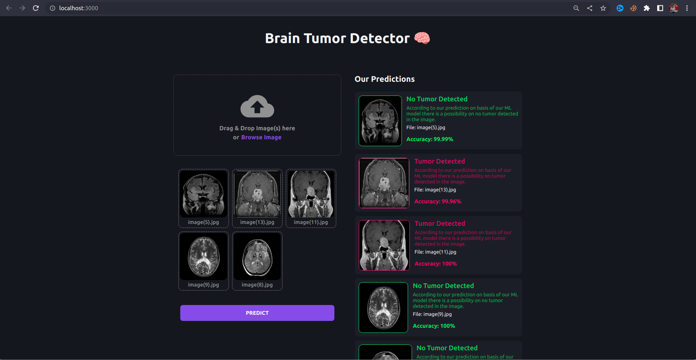

# Brain-Tumor-Detection
This project presents a CNN-based model for brain tumor detection using MRI scans. It combines ACEA, Fuzzy C-Means, GLCM, and EDN-SVM, achieving 96.59% accuracy, 94% sensitivity, 96% specificity, JC > 0.85, and PSNR > 30 dB.

# ACCEPTED 
Our research paper describing this project was accepted at ICICC-2025 (International Conference on Innovative Computing and Communication) and will be published in Springer LNNS, ensuring high visibility and academic recognition.


## Demo
  <b>Link:<b/> 
  <p>
  
  


</p>


## Get Started

Create a new enviornment
```
conda create -p venv python==3.10.6 -y
```

Activate the enviornment

```
conda activate venv/
```

Install the requirements

```
pip install -r requirements.txt
```

## Start the server

Open a new terminal and type

```
gunicorn app:app
```

## Start the web app

Open a new terminal

```
cd client
```

Install the dependencies
```
npm install
```

Start the react app
```
npm start
```


# About the project

```
Problem Statement:
Brain tumors often cause dramatic physical disabilities; the treatment for such disabilities is normally very intense and, at times, even painful. In spite of the effects of their difference from individual to individual in terms of size, location, and type, a tumor in the brain can cause severe physical disability if it presses against parts responsible for movement. Therefore, early diagnosis is crucial to possibly avoid such a level of disability. For the above purpose, traditional transfer learning approaches are further utilized in contrast with the customized 3-layer CNN model to address such classif ication issues by improving the Accurate detection and categorization of brain tumors.
```

## Machine learnng model
The above section explains the in-detail overview of the identification procedure for brain tumors using EDN-SVM techniques on the basis of MRI images. It gives an idea of how the workflow of the presented technique works , with a preprocessed version of the collected MRI data as ACEA along with application of median filter to cancel the noise in the database. These segmented images are then used and filtered through a fuzzy C-means technique; feature extraction is done using the Gray Level Co-occurence matrix , later are classified by EDN-SVM method to differentiate it as healthy brain tissue areas or tumor-affected brain regions.

The suggested approach is utilized for detection and classification brain tumors involves several steps aimed at improving the accuracy of tumor detection in an MRI scan. It begins with Input Data Acquisition, where an MRI image dataset is acquired. Based on the scanning of brain tissues in the MRI, tumors are identified as likely abnormalities in the brain. After this, there are preprocessing techniques that are performed on the input images to improve the quality of these images. An image is first enhanced in contrast using the Adaptive Contrast Enhancement Algorithm (ACEA) for better detection of regions of interest, especially tumors. A Median Filter is then applied to eliminate noise while keeping the edges intact, which is important for feature identification. The output of this stage is a noise-free image that has been enhanced for further analysis. In the second step, Segmentation divides the region of interest, specifically the tumor regions, from surrounding brain tissues. The used algorithm for this purpose is called Fuzzy C-Means Clustering. This algorithm separates tumor regions from normal tissue using the principle of similarity in classifying pixels. Fuzzy C-Means is really appreciable when overlapping of regions as well as uncertainties in data prevail in it and enhances the segmentation process by which such overlapping regions are better separated. After segmentation, Feature Extraction is performed to bring out the prominent features of the segmented regions. The GLCM is applied to calculate statistical features like Mean, Entropy, Energy and Contrast. These features assist in texture analysis and differentiation between normal and abnormal tissues, which is vital for tumor detection. Once the features have been extracted, it will go to the classification model 4as to whether the tissue is normal or abnormal. In the methodology used above, the adopted model is a Integration of Support Vector Machines and Ensemble Deep Neural Networks, popularly known as EDN-SVM.This is theoretically a hybrid of a classifier encompassing the properties from deep neural networks and advantages provided by support vector machines. With the ensemble approach followed in this methodology, enhancing classifications was through multiple classifiers available for optimum performance. The classification will have two outputs: regions classified as either Normal Tissue, meaning no anomalies are present, or as Abnormal Tissue, meaning the regions contain tumors or other abnormalities. The final step is Performance Analysis, in which efficiency of the designed system is evaluated. Performance metrics such as accuracy, sensitivity, specif icity, and precision are used for measurement to verify whether the proposed system was able to classify and detect tumors correctly.

### About  Model

 In the context of brain tumor detection, the VGG16 model can be trained to classify brain scans as either benign or malignant. Here is a brief description of how the VGG16 model works:

Input: The model takes in a brain scan as input. The input is typically a 3D array of pixel values representing the image.

Convolutional Layers: The input is passed through a series of convolutional layers, each of which extracts increasingly complex features from the input image. The convolutional layers use filters to scan the image and identify patterns and structures.

Flatten: Once the features have been extracted, the model flattens them into a 1D vector.

Fully Connected Layers: The flattened features are then passed through a series of fully connected layers. These layers perform the final classification of the input image into one of the two categories (benign or malignant). The final layer uses a softmax activation function to produce a probability distribution over the two classes.

Output: The output of the model is the probability of the input image belonging to each of the two classes. The class with the highest probability is the predicted class for the input image.

## Created Backend Rest API

REST API for Brain Tumor Detection
To make our brain tumor detection model accessible and user-friendly, we developed a RESTful API using both Flask and FastAPI. This API exposes an endpoint that accepts brain scan images and returns a prediction indicating whether a tumor is present.

We began by loading a pre-trained VGG16 model (saved using pickle) into memory. The API backend, built using Flask and FastAPI, acts as a bridge between the user and the model. When a user sends a request with an image, the server processes the image and returns a prediction in JSON format.

For image preprocessing, we utilized the Python Imaging Library (PIL) to load and convert the uploaded image into a model-compatible format. The image is then passed through the VGG16 model to generate predictions.

To ensure scalability and handle concurrent requests efficiently, the application is served using a production-grade web server like Gunicorn. Additionally, we integrated caching mechanisms to optimize performance and minimize redundant computations.

This REST API provides a reliable and efficient way to serve our brain tumor detection model and is designed for easy deployment on cloud platforms such as AWS, Google Cloud, or Heroku, making it accessible to users globally.

React-Based Front-End Interface
To enhance user experience and accessibility, we built a front-end application using React.js. This web-based interface allows users to interact with the brain tumor detection model by uploading brain scan images and receiving instant predictions.

The application features a clean, minimalistic UI. Users are greeted with an image upload form; once an image is selected and submitted, a request is sent to our Flask/FastAPI API. During processing, a loading spinner is displayed to provide feedback. When the prediction is complete, the result—indicating the presence or absence of a tumor along with a confidence score—is displayed clearly.

The front-end is built using modern React components such as image previewers, buttons, and form elements. We used CSS and responsive design principles to ensure that the interface works seamlessly across devices and screen sizes.

By combining a React front-end with a robust Flask/FastAPI backend, our application delivers a streamlined and intuitive way for healthcare professionals and patients to analyze brain scan images using deep learning.